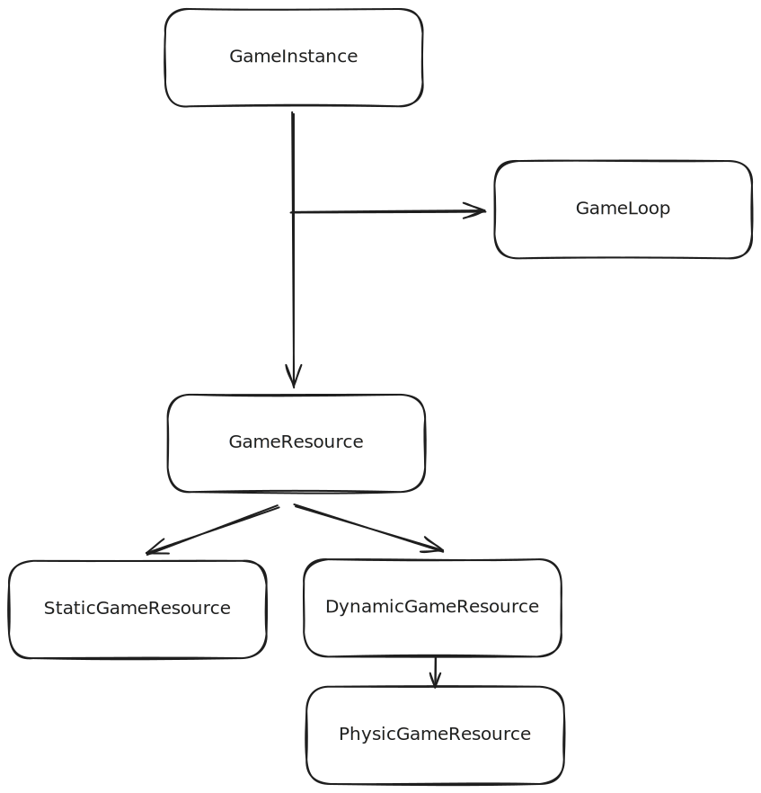
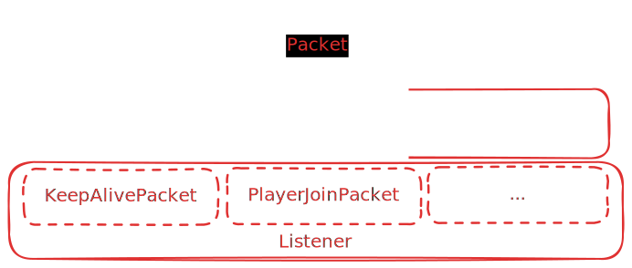

# OOPFightingGame

## Beschreibung

Ein von Super Smash Bros inspiriertes Fighting Game in der Seitenansicht. Es soll möglich sein mit mehreren Spielern zum selben lokal gehosteten Server zu verbinden und zusammen auf derselben Karte ein «best of 3» zu spielen. Jedes Mal, wenn ein Spieler von einem anderen Spieler getroffen wird, steigt seine Anfälligkeit auf Angriffe. Dadurch verursachen Treffer von anderem Spieler mehr Rückstoss was dazu führt, dass die Chance steigt, dass die betroffenen Spieler von der Plattform geschlagen werden. Nach jedem Tot wird diese Anriffsanfälligkeit wieder zurückgesetzt. Es können zufällige Powerups auf der Map spawnen  Die Kommunikation zwischen den Clients soll durch eine Mischung aus UDP und TCP-Packages gewährleistet werden. Somit können wichtige Events per TCP übertragen werden, weniger wichtige wie ein Positionsupdate jedoch über das schnellere UDP-Protokoll.

## Game Konzept

## Server Konzept
Es gibt einen Zentralen Server welcher Serialisierte Packete von allen Spielern erhält, diese verarbeitet und wenn nötig an andere Spieler weiterleitet. Dabei gibt es zum einen die Struktur der Packete welche Server wie auch Clientseitig übereinstimmen und somit per Netzwerk versendet werden können. Zusätzlich gibt es die PacketListener welche entweder beim Server oder beim Client registriert werden können und einzelne Packete verarbeit.

## Docs

- [Getting Started](doc/Starter.md)
- [Client](doc/Client.md)
- [Server](doc/Server.md)